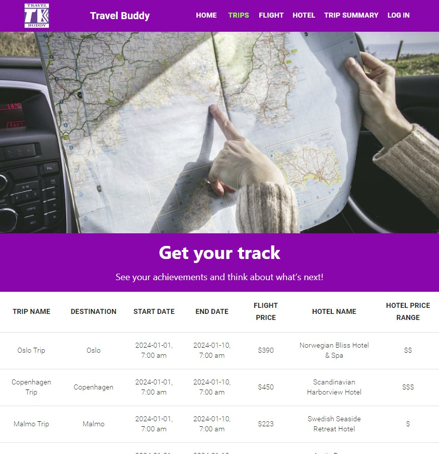
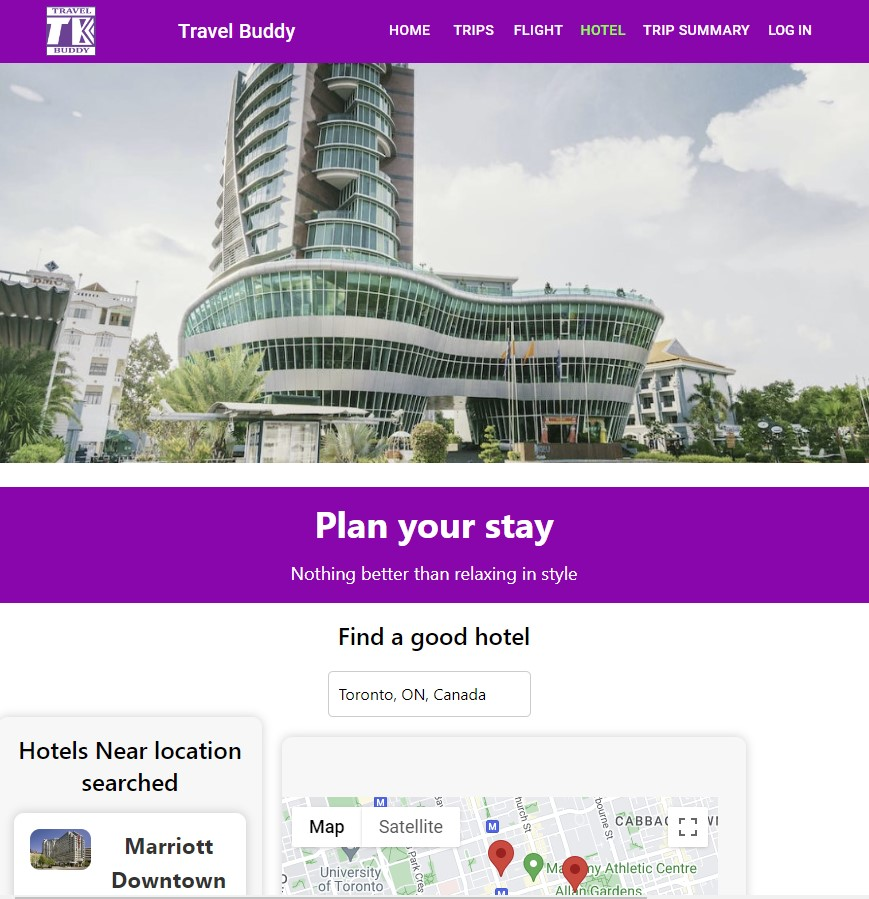
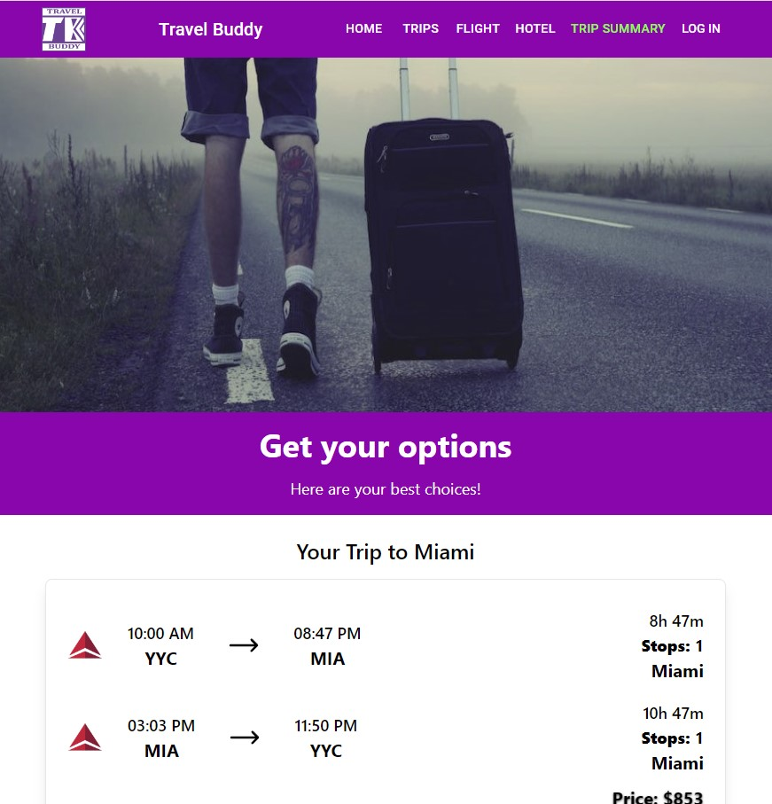
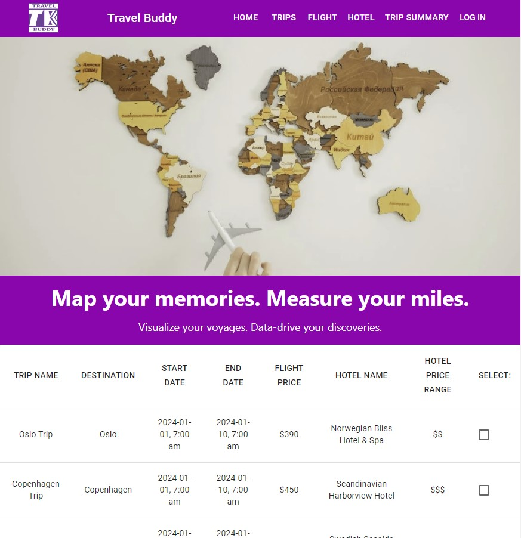

# Travel Buddy
**A Travel Planner Application**

Welcome to Travel Buddy - your new trip planning buddy! 🗺️

Travel Buddy allows you to easily search, organize and plan trips from start to finish. Forget spreadsheets and notes, bring your travel plans together in one place!

## Features

- ✈️ **Flight Search** - Find the best flights using real-time data from Skyscanner
- 🏨 **Hotel Search** - Search hotels and rental listings with TripAdvisor integration
- 🌍 **Location Search** - Easily find destinations with integrated Google Maps
- 🔐 **User Profiles** - Securely login and access your trips with Auth0

## Built With

**Frontend**
* React - Frontend framework
* Tailwind CSS - Styling
* Material UI - Component library

**Backend**
* Node.js - Runtime environment
* Express - Web application framework
* Postgres - Database

**APIs**
* Skyscanner - Flight data
* Google Maps - Hotels, listings, maps & location data
* Auth0 - User authentication

## Getting Started
Get your next adventure started with Travel Buddy!

## Prerequisites
* Node.Js installed -npm installed
* A .env file with REACT_APP_RAPIDAPI_KEY and REACT_APP_GOOGLE_API_KEY to make APIs work 
* Install all dependencies

## Running the projects

You need **TWO** terminal windows/tabs for Travel Buddy (or some other plan for running two Node processes).

In one terminal, `cd` into `react-front-end`. Run `npm install` or `yarn` to install the dependencies. Then run `npm start` or `yarn start`, and go to `localhost:3000` in your browser.

In the other terminal, `cd` into `express-back-end`. Run `npm install` or `yarn` to install the dependencies, then `npm start` or `yarn start` to launch the server.

In terminal from Postgres you need to make sure thatyou grant privileges to run the application against the database `GRANT ALL PRIVILEGES ON ALL TABLES IN SCHEMA public TO new_user;` and `GRANT ALL PRIVILEGES ON ALL SEQUENCES IN SCHEMA public TO your_user;` and remeber to put you user from Postgres in 'your_user" placeholder.

In the browser, you can click on the button and see the data get loaded.

The main important bit is that the React project has `proxy` set to `localhost:8080` in the `package.json` file, and that the Express app listens to port 8080 in `server.js`. Take a look!

**Installation**

1. Clone the repository:

   ```shell
   git clone https://github.com/mytravelbuddy

2. Install dependencies:

   ```shell
   npm install

3. Create environment variables

4. Install dependencies:

   ```shell
   npm start

5. Open http://localhost:3000 to view in browser

## Final Product

### Home Page


### Trips Page


### Flights Page


### Hotels Page


### Summary Trip Page


### Comparisons Page


## Next steps

From here, is just work improving the project!

As soon as the dependencies are installed, the Express server can serve JSON and static assets (like images) in response to API calls from the React app. You can check on React app, routing plan, etc. and see how this arquitecture was implemented! Any request that isn't handled by React is passed on to the Express server. That means that you can call a route like `/api/travellers` from React using `fetch`, `axios`, or something else, and Express will receive it as though they originated from the Travel Buddy app.

You should install and configure a database driver for Postgres as we have using in this project or any other database as, MySQL, MongoDB etc to get data interacting and make this app work correctly, you can find scripts used to run queries to create each table anda data used to interact in our application.

**License**

This project is licensed under MIT - see LICENSE.md for more details.

## Acknowledgements

Inspiration and resources from:
* Airbnb
* Expedia
* Unsplash (travel photos)
* React + Express No-Fluff Boilerplate - LHL

## The team

- Glauber Marques: https://github.com/glaubervilane

- Fred Nguyen: https://github.com/fredngu

- Paul McAllister: https://github.com/pmcall
